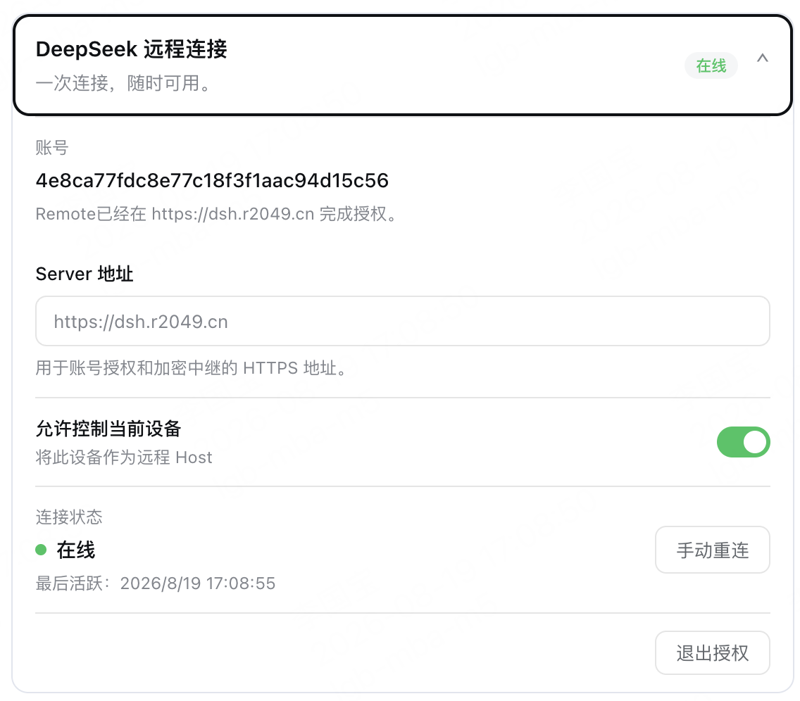
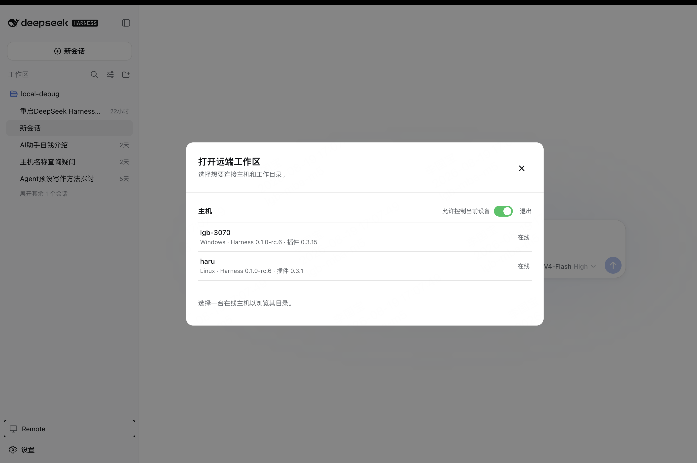
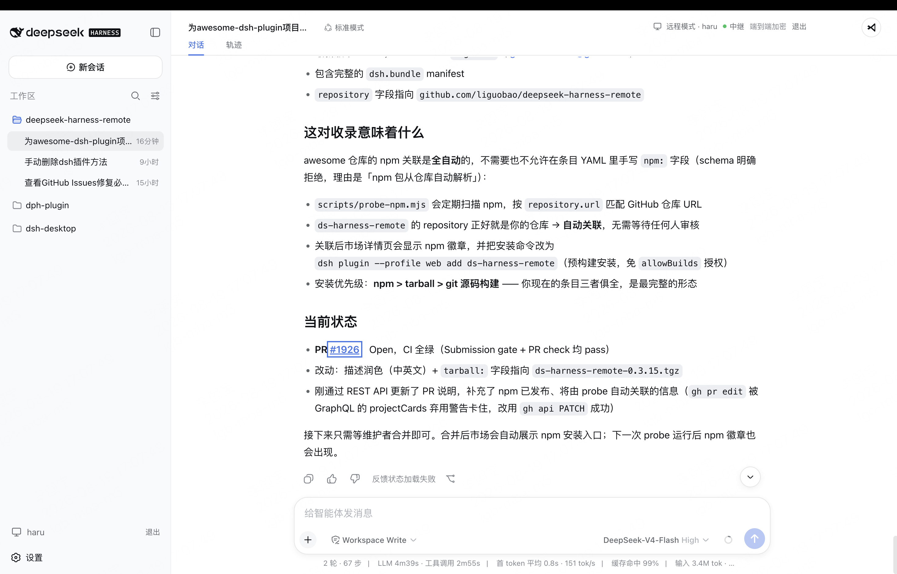

# DeepSeek Harness Remote

[English](README.md) | 中文

## 一次连接，随时可用。

从手机、平板或任意浏览器继续 DeepSeek Harness 会话。

无论使用哪台设备，都可以回到同一个 Harness 会话。Harness 始终运行在工作电脑上，原有的工作区、工具和项目配置保持不变。Remote 只是通往这个工作环境的另一个窗口。

> **开发者预览** — 安装时请固定到明确版本。

## 你可以

- 跟进正在进行的会话，查看最新进展
- 发送新的指令，或调整任务方向
- 回答问题，处理权限请求
- 打开任意已连接电脑上的工作区
- 配合可选的 `dsh-file-viewer` 插件预览远端工作区文件
- 在设备之间切换，而无需迁移工作

你可以在浏览器中打开 Remote，也可以从另一台电脑的 Harness 进入 **Remote** 工作区。

仓库的 [`apps/vscode`](apps/vscode) 还提供开发者预览版 VS Code 客户端，可登录账号、固定并连接
已授权 Host，并按 Host → Workspace → Session 浏览、在编辑区打开会话。使用 `pnpm --filter deepseek-harness-remote-vscode build` 构建，
详情见其 [README](apps/vscode/README.md)。

## 安装 Host 插件

在运行 Harness 和项目的电脑上安装插件。

在 DSH Desktop 中打开 **扩展 → 管理插件…**，安装：

```text
ds-harness-remote
```

也可以为 `web` profile 使用命令行安装：

```sh
dsh plugin --profile web add ds-harness-remote
```

项目地址：[npm](https://www.npmjs.com/package/ds-harness-remote) · [GitHub](https://github.com/liguobao/deepseek-harness-remote)

如需固定 GitHub Release，也可以安装 `github:liguobao/deepseek-harness-remote#v0.3.21`。

安装后请重启 Harness。

`0.3.21` Client 继续兼容 `0.3.15` Host 的远端 Workspace 与会话；远端命令目录、文件查看等后续能力只会在所选 Host 支持时启用。

## 登录与连接

1. 从 Harness 侧边栏打开 **Remote** 入口。
2. 使用 GitHub/知乎扫码登录，或使用账号密码登录。新注册账号密码用户可使用当前邀请码 [NRAE-NUUM-C9UY](https://dsh.r2049.cn/app/register?invite_code=NRAE-NUUM-C9UY)。
3. 为当前机器启用远端控制，即可从其他设备访问这台机器；也可以直接选择另一台在线设备并控制它。
4. 选择已有 Workspace，或浏览远端目录后打开 Workspace。

> **注意：** 自建中转节点方案将在稍后提供。

### 界面导览

在 Remote 设置中启用**允许控制当前设备**，即可将当前电脑作为 Host 供其他设备连接。

<p align="center">
  
</p>

在另一台电脑上打开 **Remote**，选择在线 Host，再选择已有 Workspace 或浏览远端目录。

<p align="center">
  
</p>

Workspace 会在 Harness 原生界面中打开，顶部会显示当前 Host 和端到端加密连接状态。

<p align="center">
  
</p>

## 安全连接，边界清晰

- Host 只主动向外连接，不开放公网端口。
- 会话流量经过端到端加密；服务端只中继密文，不保存会话明文或设备私钥。
- Remote 仅开放界面所需的 Harness 能力，不提供 Shell 或远程桌面。
- Workspace 选择器仍只列出文件夹；两端安装 `dsh-file-viewer` 后，可通过受限、加密的分块读取在原有只读查看器中预览文件。
- 远端文件预览不能写入、删除、上传、执行文件，也不能调用远端系统的“外部打开”；允许根目录与 locator 授权仍由 File Viewer provider 执行。
- 移除设备后，对应的 Remote 访问立即失效。

实现细节请参阅[插件说明](packages/plugin/README.md)、[文档索引](docs/README.md)和[远程协议](docs/protocol.md)。

## License

[MIT](packages/plugin/LICENSE)
